## mrchriscarpenter

> Software engineer and application development leader building maintainable web systems, clean developer workflows, and civic tech that respects people’s time.

### `$ whoami`

I'm a software engineer and Application Development Supervisor for [@polkcounty](https://github.com/polkcounty), where I help build, modernize, and guide the development of applications, internal tools, APIs, and team workflows.

I care about software that is maintainable, understandable, and useful in the real world — systems that help teams move faster without making the future harder.

### `$ focus`

- Leading application development with a hands-on engineering mindset
- Building internal tools, civic software, APIs, and modern web applications
- Improving developer experience through strong defaults, automation, templates, testing, and documentation
- Using AI-assisted development pragmatically to speed up research, iteration, and delivery
- Turning messy workflows into simpler, more reliable systems

### `$ stack`

**Daily drivers**  
Go · TypeScript · Svelte · Next.js · React · PostgreSQL

**Tools and workflows I reach for often**  
Docker · GitHub Actions · Tailwind CSS · Biome · Vitest · Playwright · Bun

**Also experienced with**  
Python · MySQL · SQL Server · MongoDB · Azure · DigitalOcean

### `$ featured`

**[next-starter](https://github.com/mrchriscarpenter/next-starter)**  
A minimal, opinionated Next.js starter template powered by Bun, TypeScript, Tailwind CSS, Biome, Ultracite, commitlint, and Lefthook.

Built around a simple idea: good defaults make projects easier to start, easier to review, and easier to maintain.

### `$ leadership`

My favorite engineering work sits at the intersection of code, systems, and people.

I like setting teams up with clearer patterns, stronger defaults, better workflows, and tools that remove friction. Whether I’m building a feature, reviewing an architecture decision, improving a deployment path, or mentoring another developer, I’m usually asking the same question:

> Will this make the next version easier to build?

### `$ nerd_corner`

- **Editor:** [VS Code](https://code.visualstudio.com)
- **Terminal:** [Ghostty](https://ghostty.org)
- **Theme:** [Catppuccin Frappé](https://catppuccin.com)
- **Font:** [Terminess Nerd Font](https://www.nerdfonts.com/font-downloads)
- **Notes:** [Obsidian](https://obsidian.md)
- **Favorite vibe:** clean commits, fast feedback loops, boringly reliable software
- **Currently interested in:** Go, Svelte, practical AI workflows, and developer experience
